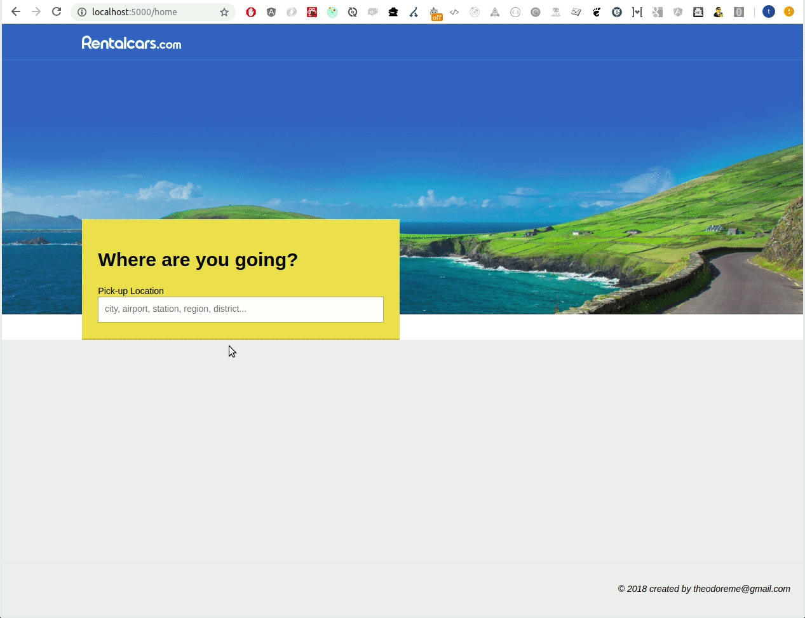
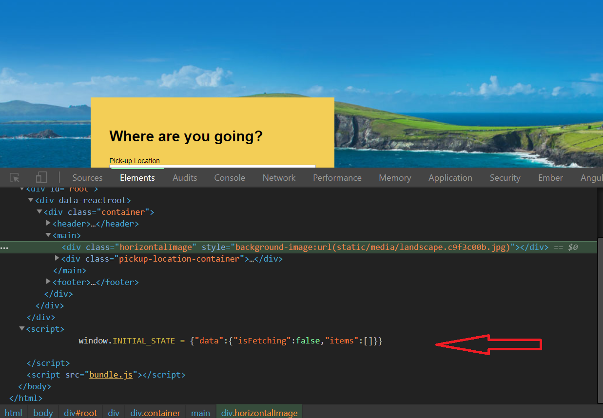
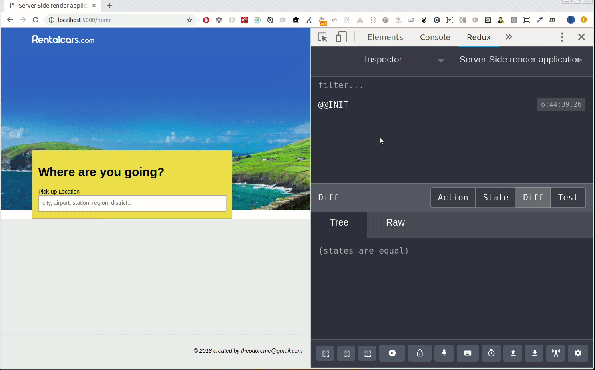

## Table of Contents
- [Table of Contents](#table-of-contents)
- [About](#about)
- [Workflow](#workflow)
- [devtools](#devtools)
- [Folder structure](#folder-structure)
- [Run local](#run-local)
- [Todo](#todo)


## About
* Fullstack react+redux application that uses SSR to render a page on server side and pass it to the browser. The main component on the home page (http://localhost:5000/home) makes requests to API sever to fetch & display list of data.




- Functionalities:
  - Website is first load on server side, the store is created and it sents to the browser.
  - app make requests to https://cors.io/?https://www.rentalcars.com  API, when the user types on the input box, to get data


* It is written in reactjs + reduxjs mainly and also:
- react ^16.7.0-alpha.2
- eslint with airbnb-config rules
- webpack 4
- babel 7
- prop-types
- sass

## Workflow

* Init: localhost:5000/home
* Server renders the website, redux inits the store, and sends it to the client.
* Client side, the store from global window.INIT_STATE is hooked and shapes client's init store.
* The init state that sended from server is like so:



## devtools

- Redux devtools are enabled and all the actions and the current state are logged and displayed, in realime.
- Inside `store.js` we enable devtools and pass it to the store, like so:

```javascript
const enhancers = [applyMiddleware(thunk)]

if (process.env.NODE_ENV === 'development') {
  const { devToolsExtension } = window
  if (typeof devToolsExtension === 'function') {
    enhancers.push(devToolsExtension())
  }
}
```



## Folder structure

The structure of the project is this:
```
  client/
    components/
      footer/
      header/
      horizontalImage/
      pickup/   this is the main component
      Routes/
    middlewares/
    pages/
      home/
      noFoundPage/
    App.js
    combineReducers.js
    constants.js
    index.js
    store.js
    style.scss
    variables.scss
  server/
    helpers/
      createStore.js
      renderer.js
    index.js
  .eslintrc
  .gitignore
  package.json
  template.html
  webpack.client.js
  webpack.server.js
```

## Run local

In order to run localhost we could:

* download/clone the repo to a folder
* execute npm install to install all the dependencies
* we need to create bundle.js for client and server and start webserver
  ```"scripts": {
    "dev": "npm-run-all -p dev:*",
    "dev:server": "nodemon --watch build --exec node build/bundle.js",
    "dev:build-server": "webpack --config webpack.server.js --watch",
    "dev:build-client": "webpack --config webpack.client.js --watch"
  },```

* we can start the scripts separate, like so:
  1. npm run dev:build-server
  2. npm run dev:build-client
  3. npm run dev:server


* we could start all in once like so:
  1. $ npm run dev  // currently that script halts (on first time, before the build & public folders are created & while there are no bundle.js at all).
  2. but currently we can do it if we run the 1 & 2 above.

* open your browser on http://localhost:5000/home
* other url will give us a no page found message


## Todo

* add unit tests
